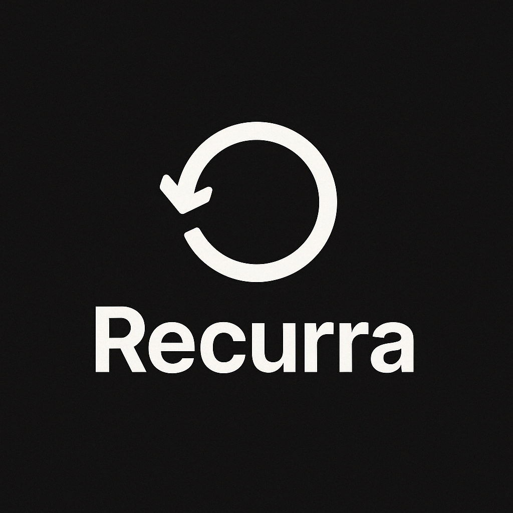

# 🔁 Recurra

**Recurra** is a Python-powered, terminal-based loop player for generative musicians, live coders, and AI-assisted creators. It features real-time loop control, audio effects, and AI-generated samples using multiple LLM APIs.



---

## ✨ Features

- 🔄 **Real-Time Loop Playback** — Seamlessly load, modify, and switch loops on the fly  
- ⏱️ **Live Loop Timing Control** — Adjust tempo, pitch, or quantization in real-time  
- 🧠 **AI-Assisted Generation** — Integrate OpenAI, Claude, Gemini, Mistral, or local models via Ollama  
- 🎛️ **Audio Effects Engine** — Apply filters, delays, reverb, pitch shift and more  
- 🎹 **MIDI + Keyboard Bindings** — Full hardware support for live use  
- 🧑‍💻 **Live Coding Console** — Change code & sound dynamically while playing  
- 🔌 **Plugin/Effect Extensions** — Customizable modular system  

---

## 🚀 Quick Start

```bash
# Clone and install dependencies
git clone https://github.com/frangedev/Recurra.git
cd Recurra
pip install -r requirements.txt

# Start loop player
python recurra.py
```

---

## 🔧 Realtime Examples

```bash
# Load a loop with effect
python recurra.py load loops/kick.wav --loop --fx delay

# Adjust BPM while running
> bpm 140

# Switch loop timing
> quantize 1/4

# Live AI generation (OpenAI)
python recurra.py gen --style techno --length 8 --api openai

# Change API and regenerate
> api claude
> gen --style ambient --length 16
```

---

## 🧠 Supported AI APIs

- **OpenAI** (ChatGPT, GPT-4)
- **Anthropic Claude**
- **Google Gemini**
- **Mistral**
- **Ollama** (for local LLMs)
- 🔄 Runtime switching with `api` command

Configure your `config.json`:

```json
{
  "api_keys": {
    "openai": "sk-...",
    "claude": "sk-...",
    "gemini": "sk-...",
    "mistral": "",
    "ollama_url": "http://localhost:11434"
  },
  "default_api": "openai",
  "default_bpm": 120,
  "loop_dir": "./loops"
}
```

---

## 🧱 Directory Structure

```
/recurra
├── loops/           # Audio loops & samples
├── fx/              # Built-in audio effects
├── ai/              # API interfaces
├── core/            # Playback engine
├── ui/              # Terminal UI / live console
├── config.json      # User configuration
└── recurra.py       # Main application
```

---

## 🛠 Effects Available

- `reverb`
- `delay`
- `distortion`
- `lowpass`
- `highpass`
- `bitcrusher`
- *(add your own via `fx/`)*

Use like:

```bash
# Add an effect
> effect add reverb

# Set effect parameters
> effect set reverb decay 0.8
> effect set reverb mix 0.5

# Remove an effect
> effect remove reverb

# List available effects
> effect list

# List active effects
> effect active

# Clear all effects
> effect clear
```

---

## 🤝 Contributions

Contributions, feature requests, and loop packs are welcome! Fork and PR!

---

## 📜 License

MIT License — hack, loop, and remix freely.

---

## 🎧 Made by

[@frangedev](https://github.com/frangedev) — built for coders who groove.
